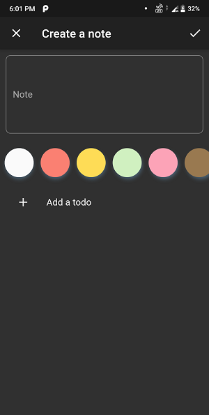

# Notes App (Flutter + Firebase)
Notes App made with Flutter by employing the principles of Domain Driven Design. Its backend is powered by Firebase. This project is made by following this [tutorial series](https://resocoder.com/2020/03/09/flutter-firebase-ddd-course-1-domain-driven-design-principles/).

## Preview

